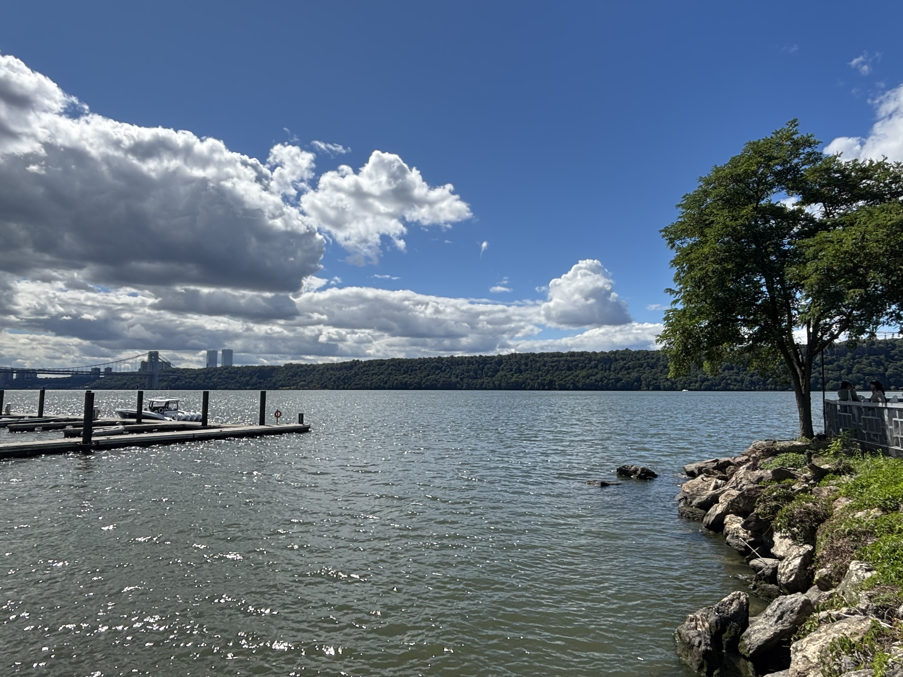

# Welcome

Hi! I’m **Liliang Su**, a graduate student in **Biostatistics** with interest in **Transfer Learning**, **Causal Inference**, and **Statistical Modeling**.  

This website showcases my academic work, data visualization projects, and professional experience.

Learn more [about this site](about.html). 

# Main Content

You can explore my pages below:

- <i class="fa-regular fa-file"></i>  View my [Resume](resume.html) for academic and professional background.

- <i class="fa-regular fa-image"></i>  Check out the [Plots](plotly.html) and [Dashboard](dashboard.html) based on NYC restaurants dataset from the [P8105](https://p8105.com/index.html) course. 

- <i class="fa-brands fa-github"></i>  Visit my [GitHub](https://github.com/LiliangSu103) profile for additional projects and code.

Feel free to connect with me on [GitHub](https://github.com/LiliangSu103) or reach out via [Email](mailto:ls4236@cumc.columbia.edu).

